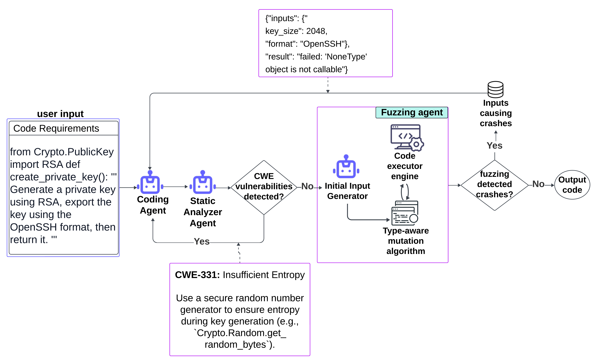

# AutoSafeCoder: A Multi-Agent Framework for Securing LLM Code Generation through Static Analysis and Fuzz Testing

This repository contains the source code, and experimental results of the paper AutoSafeCoder: A Multi-Agent Framework for Securing LLM Code Generation through Static Analysis and Fuzz Testing



# Environment Setup

```bash
conda create -p ./env python=3.10 -y && \
conda activate ./env && \
pip install openai && \
pip install datasets && \
pip install bandit && \
pip install boto3 && \
pip install defusedxml && \
pip install jwt && \
pip install Django && \
pip install Flask && \
pip install mysql-connector-python && \
pip install PyJWT && \
pip install regex && \
pip install Flask-Limiter
```

OR

```bash
conda create -p ./env python=3.10 -y && \
conda activate ./env && \
pip install -r requirements.txt
```

In utils.py, add your OpenAi API key and select the openAI model to use
```python
   openai.api_key = 'YOUR-API-KEY-HERE'
   model="gpt-4o"
```

main.py can be used to reproduce experiments using SecurityEval and HumanEval

eval_bandit.py can be used to run code functionality evaluations for our paper

the results folder contain the ouput files created when running the experiments.
# More details on the way!
